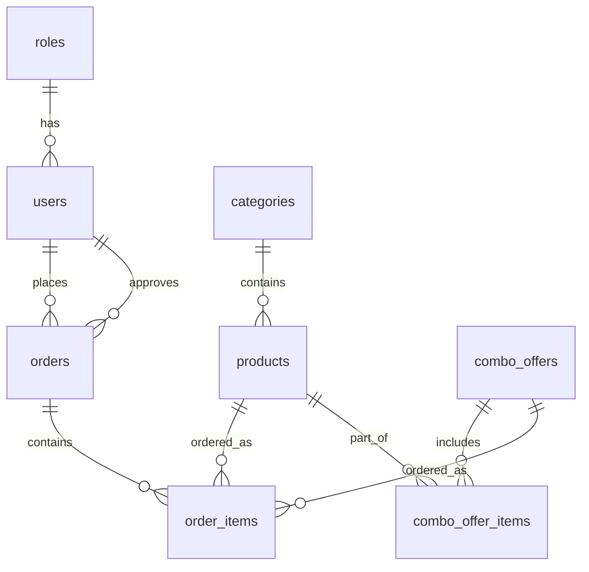
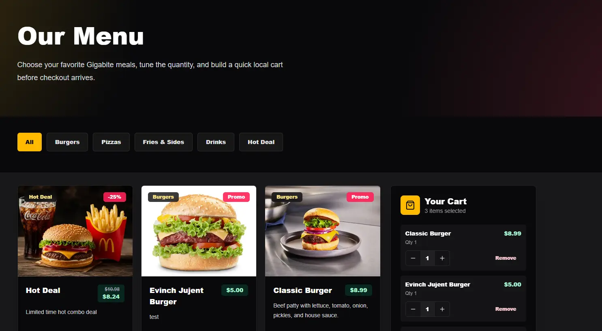

# Gigabite

Gigabite е Capstone проект за модерна платформа за поръчка на храна. Проектът включва уеб приложение, мобилно приложение, REST API, автентикация, система за поръчки, административен панел и Hot Deal оферти.

Платформата позволява на клиентите да разглеждат меню, да добавят продукти в количка, да избират вземане от място или доставка и да следят своите поръчки. Мениджърите управляват менюто, промо продуктите, Hot Deal офертите, потребителите и поръчките. Служителите обработват одобрени поръчки през отделен staff изглед.

## Capstone Информация

- GitHub repository: https://github.com/velchev750-source/gigabite-app
- Web live URL: https://gigabitefoodapp.netlify.app
- Mobile live URL: https://gigabitefoodapp-mobile.netlify.app
- Demo клиент: `user100@gigabite.demo` / `Pass100`
- Demo служител: `staff200@gigabite.demo` / `Pass200`
- Demo мениджър: `manager300@gigabite.demo` / `Pass300`

Demo акаунтите се създават от seed скрипта и са описани и в [SETUP_INSTRUCTIONS.md](./SETUP_INSTRUCTIONS.md). Production deployment-ът използва отделни environment variables и не трябва да споделя реални secrets в repository-то.

## Основни Функционалности

### Клиент

- Регистрация и вход в профил.
- Разглеждане на активно меню по категории.
- Промо продукти на началната страница.
- Количка за уеб и мобилно приложение.
- Създаване на поръчка само от влязъл потребител.
- Избор между `pickup` и `delivery`.
- Адрес за доставка при поръчки с доставка.
- Добавяне на бележка към поръчка.
- Преглед на активна поръчка и история на поръчките.
- Детайлен екран за конкретна поръчка.
- Заявка за отказ на поръчка при позволени статуси.
- Hot Deal оферти с автоматично изчислена отстъпка.
- Мобилно клиентско изживяване чрез Expo приложение.

### Мениджър

- Преглед на поръчки по статус.
- Одобряване на чакащи поръчки.
- Отказване на поръчки и одобряване на заявки за отказ.
- Редакция на бележки към поръчки.
- Редакция на адрес за доставка при подходящи поръчки.
- Управление на продукти: име, описание, цена, категория, статус, промо статус и снимка.
- Използване на категориите от базата данни при подреждане и редакция на менюто.
- Управление на промо продукти, показвани като специални предложения.
- Управление на Hot Deal оферти.
- Качване на снимки за продукти и Hot Deal оферти чрез Cloudflare R2.
- Създаване на клиентски и служителски акаунти.
- Редакция на служителски профили.

### Служител

- Преглед на одобрени, активни и завършени поръчки.
- Стартиране на подготовка на поръчка.
- Маркиране на поръчка като завършена.
- Staff статистики за работния процес.

## Hot Deal Система

Hot Deal системата е реализирана като фиксирана оферта от точно 3 продукта.

Мениджърът избира три продукта, име, описание, снимка, процент отстъпка и активен статус. Сървърът изчислява оригиналната цена като сбор от цените на включените продукти и автоматично пресмята крайната цена след отстъпката.

При поръчка Hot Deal офертата се записва като група от продукти в `order_items`, като се пазят:

- име на офертата;
- процент отстъпка;
- оригинална цена;
- крайна цена;
- ключ за групиране на продуктите от една Hot Deal поръчка.

Така историята на поръчките остава коректна дори ако по-късно цените на продуктите бъдат променени.

## Потребителски Поток

### Поток за поръчка

1. Клиентът разглежда менюто или Hot Deal офертите.
2. Добавя продукти или Hot Deal оферта в количката.
3. Отваря checkout екрана.
4. Избира `pickup` или `delivery`.
5. При доставка въвежда адрес.
6. Потвърждава поръчката.
7. Системата създава поръчка със статус `pending_approval`.
8. Мениджърът одобрява или отказва поръчката.
9. Служителят започва подготовка и я маркира като завършена.
10. Клиентът вижда статуса в профила си или в мобилното приложение.

### Pickup и Delivery

- `pickup` означава вземане от място и не изисква адрес.
- `delivery` изисква адрес за доставка.
- Базата данни има проверка, която не позволява delivery поръчка без адрес.

## Технологии

### Web Frontend

- Next.js 16.2 с App Router.
- React 19.2.
- TypeScript.
- Tailwind CSS 4.
- Server Components за основни страници.
- Client Components за интерактивни форми, количка и административни панели.

### Mobile

- Expo SDK 55.
- React Native 0.83.6.
- Expo Router.
- TypeScript.
- `expo-secure-store` за съхранение на токен на мобилно устройство.
- React Native Web за web export на мобилното приложение.

### Backend

- Next.js Route Handlers като REST API.
- Server Actions за уеб действия като admin, staff и account операции.
- Service layer в `apps/Gigabite-web/src/services`.
- PostgreSQL база данни чрез Neon.
- Drizzle ORM.
- Drizzle migrations.
- Zod за валидация.

### Комуникация Между Клиентите и Сървъра

- Web клиентът използва Next.js Server Components за първоначално server-side зареждане на данни.
- Интерактивните web операции използват Server Actions и вътрешни API заявки към Next.js back-end-а.
- Мобилното Expo приложение комуникира с Next.js back-end-а през REST API под `/api/mobile/*`.
- Мобилната автентикация изпраща JWT като Bearer token, докато web приложението използва cookie базирана сесия с JWT.

### Автентикация

- JWT токени.
- `bcryptjs` за хеширане на пароли.
- Cookie базирана автентикация за уеб приложението.
- Bearer token автентикация за мобилното приложение.
- Роли: `user`, `staff`, `manager`.

### Файлове и Снимки

- Cloudflare R2 за качване на снимки.
- AWS S3-compatible SDK за upload.
- Поддържани формати: WEBP, PNG и JPEG.
- Максимален размер на снимка: 5 MB.

### Deployment

- Netlify за уеб приложението.
- Netlify за статичния Expo web build на мобилното приложение.
- Neon като managed PostgreSQL база данни.
- Cloudflare R2 за публични изображения.

## Екрани

### Web Екрани

Web приложението покрива изискването за минимум 10 екрана чрез следните страници, панели и pop-up/form изгледи:

- `/` - начална страница с промо продукти и Hot Deal входна точка.
- `/menu` - меню по категории, количка и избор на продукти.
- `/register` - регистрация.
- `/login` - вход.
- `/checkout` - checkout за pickup или delivery.
- `/checkout/success` - потвърждение за успешна поръчка.
- `/account` - клиентски профил, активна поръчка и история.
- `/account/orders/[orderId]` - детайли за конкретна поръчка.
- `/admin` - manager панел за поръчки, продукти, Hot Deal оферти, потребители и служители.
- `/staff` - staff панел за обработка на одобрени поръчки.
- Product form modal - добавяне и редакция на продукти в manager панела.
- Hot Deal form modal - добавяне и редакция на Hot Deal оферти.

UI-то е responsive за desktop и mobile browsers, използва Tailwind CSS, визуални състояния, икони чрез `lucide-react`, reusable компоненти в `apps/Gigabite-web/src/components` и service layer за повторяемата бизнес логика.

### Mobile Екрани

Expo приложението покрива изискването за минимум 5 mobile екрана:

- `/(tabs)/index` - начална страница с промо предложения.
- `/(tabs)/menu` - мобилно меню.
- `/(tabs)/cart` - мобилна количка и checkout.
- `/(tabs)/orders` - клиентски поръчки.
- `/(tabs)/profile` - профил, вход, регистрация и logout.
- `/orders/[orderId]` - детайли за мобилна поръчка.
- `/order-success` - потвърждение след създаване на поръчка.

Мобилното приложение съдържа само клиентски функционалности, използва Expo Router stack/tab navigation, responsive layout за телефони и tablet ширини, и отделни компоненти и API helpers за по-лесна поддръжка.

## Структура на Проекта

```text
gigabite-app/
├── apps/
│   ├── Gigabite-web/
│   │   ├── drizzle/
│   │   ├── public/
│   │   ├── src/
│   │   │   ├── app/
│   │   │   ├── components/
│   │   │   ├── db/
│   │   │   ├── lib/
│   │   │   └── services/
│   │   ├── drizzle.config.ts
│   │   └── package.json
│   └── Gigabite-mobile/
│       ├── src/
│       │   ├── app/
│       │   ├── components/
│       │   ├── constants/
│       │   ├── context/
│       │   ├── hooks/
│       │   └── lib/
│       ├── app.json
│       └── package.json
├── packages/
├── scripts/
├── package.json
└── package-lock.json
```

### Основни Папки

- `apps/Gigabite-web` - Next.js приложение, което съдържа уеб интерфейса, REST API, service layer, база данни и migrations.
- `apps/Gigabite-web/src/app` - App Router страници и API route handlers.
- `apps/Gigabite-web/src/components` - UI компоненти за home, menu, checkout, account, admin и staff.
- `apps/Gigabite-web/src/services` - бизнес логика за auth, меню, поръчки, мениджърски и staff операции.
- `apps/Gigabite-web/src/db` - Drizzle schema, database client и seed скриптове.
- `apps/Gigabite-web/drizzle` - генерирани Drizzle migration файлове.
- `apps/Gigabite-mobile` - Expo приложение с клиентски функционалности.
- `apps/Gigabite-mobile/src/app` - мобилни екрани и навигация чрез Expo Router.
- `apps/Gigabite-mobile/src/lib` - API client функции за меню, Hot Deal, поръчки и автентикация.
- `scripts` - помощни workspace скриптове.

## База Данни

Проектът използва нормализирана PostgreSQL схема с Drizzle ORM. Основните таблици са:

- `roles` - роли на потребителите.
- `users` - потребители, служители и мениджъри.
- `categories` - категории в менюто.
- `products` - продукти.
- `combo_offers` - Hot Deal оферти.
- `combo_offer_items` - продукти в Hot Deal оферта.
- `orders` - поръчки.
- `order_items` - продукти и Hot Deal позиции в поръчки.

Основните връзки между таблиците са:



Схемата използва foreign keys, indexes за често филтрирани колони като `users.email`, `users.role_id`, `products.category_id`, `orders.user_id`, `orders.status`, `orders.created_at`, и check constraints за валидни отстъпки, положителни количества и delivery адрес при delivery поръчки.

Миграциите са в `apps/Gigabite-web/drizzle`, Drizzle schema е в `apps/Gigabite-web/src/db/schema.ts`, а seed логиката е в `apps/Gigabite-web/src/db/seed.ts` и `apps/Gigabite-web/src/db/seed-stress.ts`.

## Мащабируемост

Проектът има server-side paging за големи operational списъци:

- manager orders API: `/api/admin/orders` използва `page`, `pageSize`, `limit` и `offset`;
- staff orders API: `/api/staff/orders` използва странициране по статус;
- staff/user management API: `/api/admin/staff` използва server-side paging;
- manager и staff UI панелите имат pagination controls и периодично обновяване на активните списъци.

За performance проверка има stress seed скрипт:

```bash
npm --workspace gigabite-web run db:seed:stress
```

Той създава 10 000 demo поръчки за реалистично тестване на странициране, сортиране и индексирани заявки. Основният seed (`npm --workspace gigabite-web run db:seed`) създава роли, demo потребители, категории, продукти и примерни поръчки.

## Автоматични Backup-и

Проектът има GitHub Actions workflow за автоматичен backup на PostgreSQL базата данни към private Cloudflare R2 bucket.

Backup процесът:

- стартира веднъж дневно;
- може да се стартира ръчно чрез `workflow_dispatch`;
- използва `pg_dump` от Docker image `postgres:18`, съвместим с Neon PostgreSQL 18;
- създава gzip архив с име `gigabite-db-YYYY-MM-DD-HH-mm-ss.sql.gz`;
- качва архива в `backups/db/` в private R2 backup bucket чрез `R2_BACKUP_BUCKET_NAME`;
- изпълнява retention cleanup след успешен upload.

Retention политиката пази последните 7 backup файла. Cleanup стъпката листва файловете в `backups/db/`, разпознава само файлове с backup naming pattern, сортира ги по име в низходящ ред и изтрива само по-старите файлове след най-новите 7. Ако има 7 или по-малко backup-а, не се изтрива нищо.

Потвърдено поведение:

- upload successful;
- cleanup step executed;
- retention logic validated;
- old backup detection works;
- keep-last-7 policy active.

## Автоматизирани Тестове

Проектът има минимален автоматизиран test setup за `Gigabite-web`, подходящ за Capstone bonus проверка.

Тестовата конфигурация използва Vitest и покрива стабилна бизнес логика без нужда от реална база данни, R2 credentials, production secrets или network calls.

Покрити тестове:

- Hot Deal discount calculation;
- order total calculation;
- money/cents helper логика;
- web cart count;
- web cart total;
- cart key, name и unit price helpers;
- update/remove cart quantity behavior.

Добавен е отделен GitHub Actions workflow:

```text
.github/workflows/test.yml
```

Workflow-ът изпълнява:

```bash
npm ci
npm --workspace gigabite-web run lint
npm --workspace gigabite-web run test
npm --workspace gigabite-web run build
```

Потвърдено поведение:

- CI workflow created;
- `workflow_dispatch` manual trigger active;
- pricing calculations tested;
- web cart tests passing;
- GitHub Actions workflow run successful.

## Документация

- [SETUP_INSTRUCTIONS.md](./SETUP_INSTRUCTIONS.md) - локална инсталация и стартиране.
- [ENVIRONMENT_VARIABLES.md](./ENVIRONMENT_VARIABLES.md) - всички нужни environment variables.
- [DEPLOYMENT.md](./DEPLOYMENT.md) - deployment процес за web и mobile.
- [docs/BACKUPS.md](./docs/BACKUPS.md) - автоматични database backup-и и retention политика.

## Постигнат Performance

### Уеб приложение

<p align="center">
  
</p>

### Мобилно приложение

<p align="center">
  
</p>

## Screenshots

### Начална страница

<p align="center">
  
</p>

### Меню

<p align="center">
  
</p>

### Количка и checkout

<p align="center">
  
</p>

### Профил и история на поръчки

<p align="center">
  
</p>

### Admin панел

<p align="center">
  
</p>

### Staff панел

<p align="center">
  
</p>

### Мобилно меню

<p align="center">
  
</p>

### Мобилна количка

<p align="center">
  
</p>

## Известни Ограничения

- Мобилното приложение съдържа клиентски функционалности, без staff и manager панели.
- Категориите се използват от базата данни и seed процеса; текущият admin панел редактира продуктите и тяхната категория, но няма отделен CRUD екран само за категории.
- Плащанията не са интегрирани; проектът покрива логиката за поръчка и обработка.

## Бъдещи Подобрения

- Онлайн плащания.
- Известия за промяна на статус на поръчка.
- Отделен CRUD екран за категории.
- Разширени филтри и търсене в admin панела.
- EAS build за публикуване на мобилното приложение в app stores.
- Автоматизирани тестове за основните user flows.

## Capstone Контекст

Gigabite е разработен като цялостен Capstone проект с монорепо структура, production-oriented архитектура, реална база данни, ролеви достъп, REST API и отделни web/mobile клиентски приложения.
